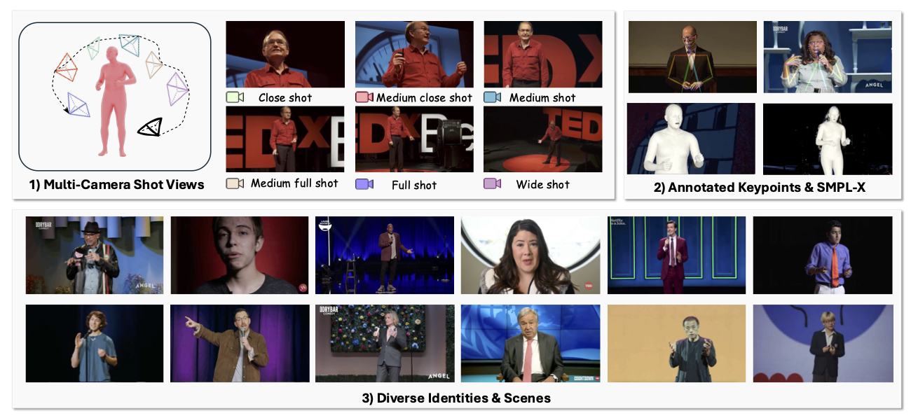

# TalkCuts: A Large-Scale Dataset for Multi-Shot Human Speech Video Generation

**NeurIPS D&B Track 2025**

**Authors:**  
[Jiaben Chen](https://jiabenchen.github.io), Zixin Wang, [Ailing Zeng](https://ailingzeng.site/), [Yang Fu](https://www.yangfu.site/), [Xueyang Yu](https://scholar.google.com/citations?user=AIm87GIAAAAJ&hl=en), [Siyuan Cen](https://sy77777en.github.io/), [Julian Tanke](https://scholar.google.com/citations?user=eVHCoTsAAAAJ&hl=en), Yihang Chen, [Koichi Saito](https://scholar.google.com/citations?user=UT-g5BAAAAAJ&hl=en), [Yuki Mitsufuji](https://www.yukimitsufuji.com/), [Chuang Gan](https://people.csail.mit.edu/ganchuang)

[](https://arxiv.org/abs/2510.07249)
[](https://talkcuts.github.io/)

---

This is the official repository of **TalkCuts**, a large-scale dataset for **multi-shot human speech video generation**.



---

## News
- **2025-12-14**: Dataset and processing code are released.
- **2025-10-08**: [Paper](https://arxiv.org/abs/2510.07249) is on arXiv.
- **2025-09-18**: TalkCuts is accepted to NeurIPS 2025!

---

## Dataset Access & Download

### 1) Request access (required)

Please fill in this form to request dataset access and obtain the download link:

- https://docs.google.com/forms/d/e/1FAIpQLSfapK7pqgyrcCaOxJn8yQc79AYaq1DOvJzL0-VZnLiA3CvpyQ/viewform?usp=dialog

After approval, you will receive a dataset link and a CSV file describing the video list.

### 2) Download videos

Use the provided CSV file to download the videos:

```bash
python download_videos.py {csv_file_path} {target_folder_path}
```

- `{csv_file_path}`: the CSV file you received / prepared after access is granted  
- `{target_folder_path}`: directory to save downloaded videos

---

## Data Preprocess Pipeline

This pipeline processes raw videos to generate high-quality segmented short clips and paired human poses for video generation training.  
It involves scene detection, body detection, filtering, pose estimation, and visualization.

### Workflow Overview

```text
Raw Videos
    |
    | (0_scene_det.py)
    v
Split Videos ---------------------+--------------------------+
    |                             |                          |
    | (1_body_det.py)             |                          |
    v                             |                          |
Body Detection Results            |                          |
    |                             |                          |
    | (2_body_filter.py)          |                          |
    v                             |                          |
Filtered Det Results              |                          |
    |                             |                          |
    +-----> (3_pose_det.py) <-----+                          |
                |                                            |
                v                                            |
        Pose Estimation Results                              |
                |                                            |
                | (4_pose_filter.py)                         |
                v                                            |
        Classified Pose Data                                 |
                |                                            |
                +-----> (5_draw_pose.py) <-------------------+
                            |
                            v
                    Visualization Videos
```

---

## 0_scene_det.py

**Function**: Detects scene changes in videos using PySceneDetect and splits them into clips.

- **Input**: Folder with video files  
- **Output**: Scene start frame indices (pickle) and split video clips  

**Env Installation**:
```bash
pip install scenedetect[opencv] tqdm
# Install FFmpeg (Mac: brew install ffmpeg / Linux: sudo apt-get install ffmpeg)
```

**Run**:
```bash
# Edit video_folder and output_folder in script
python 0_scene_det.py 0 1
```

---

## 1_body_det.py

**Function**: Detects human bodies in videos using RTMDet.

**Env Installation (Linux)**:
1. Install PyTorch (see https://pytorch.org).
2. Install MIM & MMLab:
   ```bash
   pip install -U openmim
   mim install mmengine "mmcv>=2.0.0" "mmdet>=3.0.0" "mmpose>=1.0.0"
   ```
3. Clone config:
   ```bash
   git clone https://github.com/open-mmlab/mmpose.git
   ```

**Weight Download**:
```bash
wget https://download.openmmlab.com/mmpose/v1/projects/rtmposev1/rtmdet_m_8xb32-100e_coco-obj365-person-235e8209.pth
```

---

## 2_body_filter.py

**Function**: Filters videos to keep only those where **>80%** frames contain **exactly one person** (bbox > 192px).

- **Input**: Detection pickles from Step 1  
- **Output**: Filtered pickle files  

**Run**:
```bash
# Edit in_path and out_path in script
python 2_body_filter.py
```

---

## 3_pose_det.py

**Function**: Extracts wholebody pose keypoints using [DWPose](https://github.com/IDEA-Research/DWPose) for the filtered videos.

**Env Installation**:
1. Clone DWPose:
   ```bash
   git clone https://github.com/IDEA-Research/DWPose.git
   ```
2. Dependencies: Same as Step 1 (`mmpose`, `mmdet`, `mmcv`).

**Weight Download**:
```bash
wget "https://huggingface.co/yzd-v/DWPose/resolve/main/dw-ll_ucoco_384.pth?download=true" -O dw-ll_ucoco_384.pth
```

**Run**:
```bash
# Edit paths (pickle_path, mp4_base_path, output_path, config)
python 3_pose_det.py 0 100
```

---

## 4_pose_filter.py

**Function**: Classifies videos by pose quality (keypoint scores) into:  
`whole_body`, `half_body`, `head_body`, `low_quality`.

- **Input**: Pose pickles from Step 3  
- **Output**: Classification text files and cleaned pose pickles  

**Run**:
```bash
# Edit path1, output_file, out_pose
python 4_pose_filter.py
```

---

## 5_draw_pose.py

**Function**: Visualizes pose keypoints by overlaying them on original video frames.

- **Input**: Original/Split videos and (cleaned) pose pickles  
- **Output**: Visualization videos  

**Env Installation**:
```bash
pip install pillow av
```

**Run**:
```bash
# Edit paths (video_root, pose_root, save_root)
python 5_draw_pose.py
```

---

## License & Terms (Dataset)

- The **TalkCuts dataset** is provided for **research and non-commercial use only**.
- By requesting access and/or using the dataset, you agree to:
  - Use it only for research purposes (**no commercial usage**).
  - Not redistribute the dataset (or any download links/credentials) to third parties.
  - Follow applicable laws and ethical guidelines, including privacy and consent requirements.
- For commercial licensing or additional permissions, please contact the authors.

> Note: This repository may include code under its own open-source license, while the dataset itself follows the above **research / non-commercial** terms.

---

## Citation

If you find this dataset useful in your research, please cite:

```bibtex
@article{chen2025talkcuts,
  title={TalkCuts: A Large-Scale Dataset for Multi-Shot Human Speech Video Generation},
  author={Chen, Jiaben and Wang, Zixin and Zeng, Ailing and Fu, Yang and Yu, Xueyang and Cen, Siyuan and Tanke, Julian and Chen, Yihang and Saito, Koichi and Mitsufuji, Yuki and others},
  journal={arXiv preprint arXiv:2510.07249},
  year={2025}
}
```
